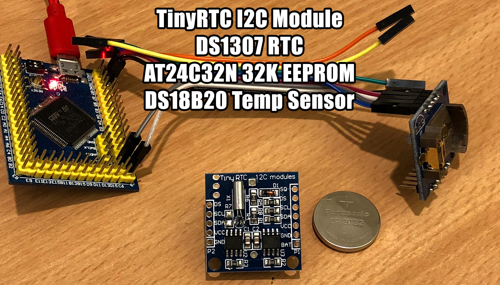

# MicroPython TinyRTC I2C module

MicroPython driver for the TinyRTC I2C module, featuring a DS1307 RTC and AT24C32N EEPROM.



## Pins

Pins are available on both sides. You can use either. One side exposes more pins.

Pin | Name            | Description
--- | --------------- | ----------------------------------------------------
BAT | Battery Voltage | For monitoring battery voltage
GND | Ground          | Ground
VCC | Input Supply    | +5V power for module and to charge coin cell battery
SDA | I2C Data        | I2C data for DS1307 and EEPROM
SCL | I2C Clock       | I2C clock for DS1307 and EEPROM
DS  | DS18B20         | Optional temperature sensor 1-wire data
SQ  | Square Wave     | Optional square wave or logic level output

# DS1307 RTC Examples

```python
# VCC-GND STM32F407VET6 on SPI3
>>> from machine import I2C, Pin
>>> i2c = I2C(3) # SCL=A8, SDA=C9
>>> i2c.scan()
[80, 104]

# 80 == 0x50 == AT24C32N EEPROM
# 104 == 0x68 == DS1307

>>> import ds1307
>>> ds = ds1307.DS1307(i2c)
ds.datetime()
ds.datetime(now)

# initial datetime value, oscillator disabled
>>> ds.datetime()
(2000, 1, 1, 0, 0, 0, 0, 0)

# read datetime after 1 second (no change)
>>> ds.datetime()
(2000, 1, 1, 0, 0, 0, 0, 0)

# enable oscillator
>>> ds.halt(False)

# read datetime after 1 second
>>> ds.datetime()
(2000, 1, 1, 0, 0, 0, 1, 0)

# read datetime after 1 more second
>>> ds.datetime()
(2000, 1, 1, 0, 0, 0, 2, 0)

# read datetime after 1 more second
>>> ds.datetime()
(2000, 1, 1, 0, 0, 0, 3, 0)

# set the datetime 24th March 2018 at 1:45:21 PM
>>> now = (2018, 3, 24, 6, 13, 45, 21, 0)
>>> ds.datetime(now)

# read datetime after 1 second
>>> ds.datetime()
(2018, 3, 24, 6, 13, 45, 22, 0)

# read datetime after 1 second
>>> ds.datetime()
(2018, 3, 24, 6, 13, 45, 23, 0)

# disable oscillator
>>> ds.halt(True)

# read datetime after 1 second
>>> ds.datetime()
(2018, 3, 24, 6, 13, 45, 24, 0)

# read datetime after 1 second (no change)
>>> ds.datetime()
(2018, 3, 24, 6, 13, 45, 24, 0)

# minute increment (00:00:59 -> 00:01:00)
>>> ds.datetime((2018, 3, 24, 6, 0, 0, 58, 0))
>>> ds.datetime()
(2018, 3, 24, 6, 0, 0, 59, 0)
>>> ds.datetime()
(2018, 3, 24, 6, 0, 1, 0, 0)

# hour increment (00:59:59 -> 01:00:00)
>>> ds.datetime((2018, 3, 24, 6, 0, 59, 58, 0))
>>> ds.datetime()
(2018, 3, 24, 6, 0, 59, 59, 0)
>>> ds.datetime()
(2018, 3, 24, 6, 1, 0, 0, 0)

# day + weekday increment (23:59:59 Sat -> 00:00:00 Sun)
>>> ds.datetime((2018, 3, 24, 6, 23, 59, 58, 0))
>>> ds.datetime()
(2018, 3, 24, 6, 23, 59, 59, 0)
>>> ds.datetime()
(2018, 3, 25, 0, 0, 0, 0, 0)

# month increment (Wed 28th Feb 2018 -> Thu 1st Mar 2018)
>>> ds.datetime((2018, 2, 28, 3, 23, 59, 58, 0))
>>> ds.datetime()
(2018, 2, 28, 3, 23, 59, 59, 0)
>>> ds.datetime()
(2018, 3, 1, 4, 0, 0, 0, 0)

# month increment on leap year Feb has 29 days (Sun 28th Feb 2016 -> Mon 29th Feb 2016)
>>> ds.datetime((2016, 2, 28, 0, 23, 59, 58, 0))
>>> ds.datetime()
(2016, 2, 28, 0, 23, 59, 59, 0)
>>> ds.datetime()
(2016, 2, 29, 1, 0, 0, 0, 0)

# month increment on leap year (Mon 29th Feb 2016 -> Tue 1st Mar 2016)
>>> ds.datetime((2016, 2, 29, 1, 23, 59, 58, 0))
>>> ds.datetime()
(2016, 2, 29, 1, 23, 59, 59, 0)
>>> ds.datetime()
(2016, 3, 1, 2, 0, 0, 0, 0)

# year increment (31st Dec 2018 -> 1st Jan 2019)
>>> ds.datetime((2018, 12, 31, 1, 23, 59, 58, 0))
>>> ds.datetime()
(2018, 12, 31, 1, 23, 59, 59, 0)
>>> ds.datetime()
(2019, 1, 1, 2, 0, 0, 0, 0)

# square wave output on pin SQ - 1Hz
>>> ds.square_wave(1, 0)

# square wave output on pin SQ - 4.096kHz
>>> ds.square_wave(4, 0)

# square wave output on pin SQ - 8.192kHz
>>> ds.square_wave(8, 0)

# square wave output on pin SQ - 32.768kHz
>>> ds.square_wave(32, 0)

# logic level output on pin SQ - high
>>> ds.square_wave(0, 1)

# logic level output on pin SQ - low
>>> ds.square_wave(0, 0)
```

# DS18B20 1-Wire Temperature Sensor Examples

```python
>>> from machine import Pin
>>> import onewire
>>> ow = onewire.OneWire(Pin('A9'))
>>> ow.scan()
[bytearray(b'(\xc9E\x01\x00\x00\x80/')]

>>> import time, ds18x20
>>> ds = ds18x20.DS18X20(ow)
>>> roms = ds.scan()
>>> ds.convert_temp()
>>> time.sleep_ms(750)
>>> for rom in roms:
...     print(ds.read_temp(rom))
23.8125
```

# AT24C32N EEPROM Examples

```python
>>> from machine import I2C, Pin
>>> i2c = I2C(3) # SCL=A8, SDA=C9
>>> i2c.scan()
[80, 104]

>>> import at24c32n
>>> eeprom = at24c32n.AT24C32N(i2c)

# read 32 bytes starting from memory address 0
>>> eeprom.read(0, 32)
b'\xff\xff\xff\xff\xff\xff\xff\xff\xff\xff\xff\xff\xff\xff\xff\xff\xff\xff\xff\xff\xff\xff\xff\xff\xff\xff\xff\xff\xff\xff\xff\xff'

# write hello world to memory address 0
>>> eeprom.write(0, 'hello world')

# read back the hello world
>>> eeprom.read(0, 32)
b'hello world\xff\xff\xff\xff\xff\xff\xff\xff\xff\xff\xff\xff\xff\xff\xff\xff\xff\xff\xff\xff\xff'
>>> eeprom.read(0, 11)
b'hello world'

# write multiple pages (32 bytes per page)
>>> eeprom.write(0, b'abcdefghijklmnopqrstuvwxyz0123456789ABCDEFGHIJKLMNOPQRSTUVWXYZ')

# read multiple pages (32 bytes per page)
>>> eeprom.read(0,64)
b'abcdefghijklmnopqrstuvwxyz0123456789ABCDEFGHIJKLMNOPQRSTUVWXYZ\xff\xff'

# mutliple page writes (fill pages 0 and 1 with test data)
# write is performed in two steps, "0" x 32 in the first page, then "1" x 32 in the next page
# memory address was at the start of a page boundary so each write is a full 32 byte page write
>>> eeprom.write(0, b'0000000000000000000000000000000011111111111111111111111111111111')
>>> eeprom.read(0,64)
b'0000000000000000000000000000000011111111111111111111111111111111'

# partial page writes
# write some bytes spanning two pages, not starting at a page boundary
# write is performed in two steps, "abc" in the first page then "def" in the next page
>>> eeprom.write(29, b'abcdef')
>>> eeprom.read(0,64)
b'00000000000000000000000000000abcdef11111111111111111111111111111'

# fill entire eeprom with 0xFF
>>> buf = b'\xff' * 32
>>> for i in range(128):
...     eeprom.write(i*32, buf)

# show page boundaries
>>> for i in range(128):
...     eeprom.write(i*32, '|-Page-{:-<24}|'.format(i))
>>> eeprom.read(0,128)
b'|-Page-0-----------------------||-Page-1-----------------------||-Page-2-----------------------||-Page-3-----------------------|'

# read entire eeprom
>>> eeprom.read(0,4096)
```

## PyBoard / STM32F4 built-in RTC

You do not need this module if you are using a PyBoard or STM32 microcontroller with [built in RTC hardware](http://www.st.com/content/ccc/resource/technical/document/application_note/7a/9c/de/da/84/e7/47/8a/DM00025071.pdf/files/DM00025071.pdf/jcr:content/translations/en.DM00025071.pdf).

Simply add a coin cell battery between GND + VBAT and use [pyb.RTC](http://docs.micropython.org/en/latest/pyboard/library/pyb.RTC.html#pyb-rtc).

On the early pyboards, VBAT is the backup battery for the RTC. On the newer boards, VBAT is for powering the pyboard using a battery and the RTC battery is called Vbackup.
- Dave Hylands on the [micropython forum](https://forum.micropython.org/viewtopic.php?f=6&t=229&p=15352&hilit=vbat#p15352)

```python
# on the PyBoard or a STM32F407
rtc = pyb.RTC()
# set time
rtc.datetime((2018, 3, 24, 6, 13, 45, 21, 0))
# attach battery between GND + VBAT
# disconnect, reconnect
# get time
print(rtc.datetime())
```

## Troubleshooting

If you are using the ESP32 [loboris port](https://github.com/loboris/MicroPython_ESP32_psRAM_LoBo), swap the `addrsize=16` for a `adrlen=2`.

## Parts

* [TinyRTC I2C module](https://www.aliexpress.com/item/Tiny-RTC-I2C-modules-24C32-memory-DS1307-clock-RTC-module-without-battery-good-quality-low-price/2020927349.html) $0.53 AUD
* [LIR2032 rechargeable coin cell](https://www.aliexpress.com/item/2x-LIR2032-Rechargeable-Lithium-Li-ion-Batteries-3-6V-40mAh-Button-Coin-Cells-Battery-For-Watch/32842926682.html) $1.19 AUD

## Connections

STM32F407VET6 | TinyRTC I2C module
------------- | ----------------------
A9 (any pin)  | DS
A8 (I2C3 SCL) | SCL
C9 (I2C3 SDA) | SDA
3V3           | VCC
GND           | GND

## Links

* [micropython.org](http://micropython.org)
* [Binary-coded decimal](https://en.wikipedia.org/wiki/Binary-coded_decimal)
* [DS1307 datasheet](https://datasheets.maximintegrated.com/en/ds/DS1307.pdf)
* [AT24C32 datasheet](http://ww1.microchip.com/downloads/en/devicedoc/doc0336.pdf)

## License

Licensed under the [MIT License](http://opensource.org/licenses/MIT).
